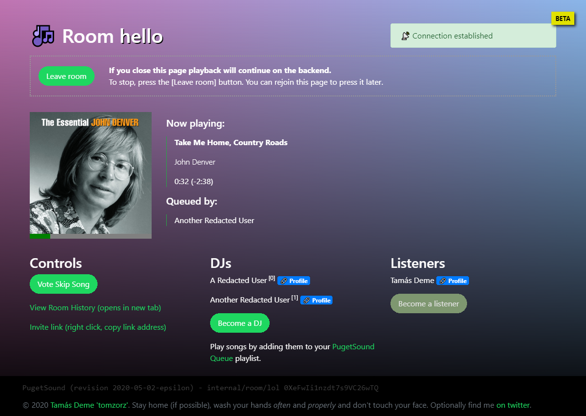

# PugetSound

PugetSound allows you and your group to enjoy music together using Spotify.

 

The main inspiration for this project was AuxParty, but I wanted to improve on the concept in a few ways:

- play music from the Spotify client
- remove the need to keep the browser page open, handle the logic on the backend
- remove the arbitrary 5 DJ limit
- make it more stable (although the stability issues might've been caused by the recent increase in use)

## Getting it to run

There's only one mandatory requirement: you'll need to create a Spotify App in their Dev center: https://developer.spotify.com/dashboard/applications

Optionally you can also set up Seq for a nice logging/monitoring interface: https://datalust.co/seq

The app needs the first 2 environment variables out of the 4 below to be set, otherwise it's "F5 ready" upon checkout. 

| Variable name       | Value                                                              |
|---------------------|--------------------------------------------------------------------|
| SpotifyClientId     | Spotify App Client ID acquired from the Spotify Developer page     |
| SpotifyClientSecret | Spotify App Client secret acquired from the Spotify Developer page |
| SeqClientAddress    | Address for the Seq logging intake                                 |
| SeqApiKey           | API key created for PugetSound in Seq                              |

## How it works

PugetSound creates a playlist called "PugetSound Queue" in your Spotify account. When you join a room and become a DJ, you'll take turns to play a song for the room members. When it's your turn, the first song from your queue playlist will be played for everyone, and it'll be also removed from said playlist. (Therefore it's not recommended to use it for other purposes.)

Unlike other solutions, PugetSound handles the synchronization and queueing on the backend, so it's not necessary to keep the tab open - as long as you have a Spotify player open on a device. This also means that you need to re-enter the room and explicitly press the [Leave room] button to retake control of your Spotify account.

## Made with

Built on `ASP.NET Core 3.1`. Uses `SignalR` for communication with the front-end. Musical parts handled by `SpotifyAPI-NET` and `AspNet.Security.OAuth.Spotify`.